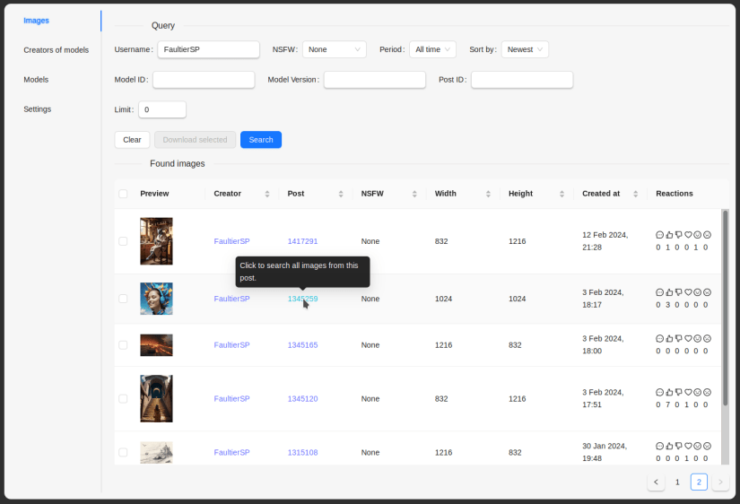

# A client for the Civitai API

A basic API client for viewing and downloading images in batches, based on search or simply all images of your favorite creator.
The app puts all the downloaded images in a folder you specify (by default in your systems "Downloads" folder) and writes the generation data (models used, prompts etc.) in the EXIF tag. The structure will be ```your_folder/creators_name/post_id-image_id.extension```.
## Installation
If your system already has WebView2 installed you can try to run the .exe or Linux binary directly. If it doesn't work, use the installers (.msi or setup.exe for Windows, .deb or .rpm for Linux), they should take care of it. Alternatively, everything is packed in an Linux AppImage.

I'm not quite sure why there is a possibility of providing an API key, the result seem to be the same with or without it. Maybe the Civitai team will implement some extended functionality in the future. However, if you want to be ahead of breaking changes, you can generate your own key [here](https://civitai.com/user/account): Civitai.com ➔ Account settings ➔ API keys.

This application uses [Confy](https://crates.io/crates/confy) crate to store configuration. It uses a .toml file in the app's directory to store your API key, prefix and other settings.
## Building the app
[Here](https://tauri.app/v1/guides/getting-started/prerequisites) is the current doc on how to build a Tauri app. I've had some problems with the ```libayatana-appindicator3-dev``` packet on Debian, but coult install it from backports. Your npm installation should also include the Tauri CLI tools, they can be installed by running ```npm install @tauri-apps/cli```

Then you can simply build it by
~~~
npm run tauri build
~~~
## Credits
### Civitai API
[API Reference](https://github.com/civitai/civitai/wiki/REST-API-Reference)
### Building blocks
This project uses [Tauri](https://tauri.app/) to create a cross-platform application and [React](https://reactjs.org/) to create the user interface. [Confy](https://crates.io/crates/confy) is used to store configuration and [little_exif](https://crates.io/crates/little_exif) to write the generation data into the file.
